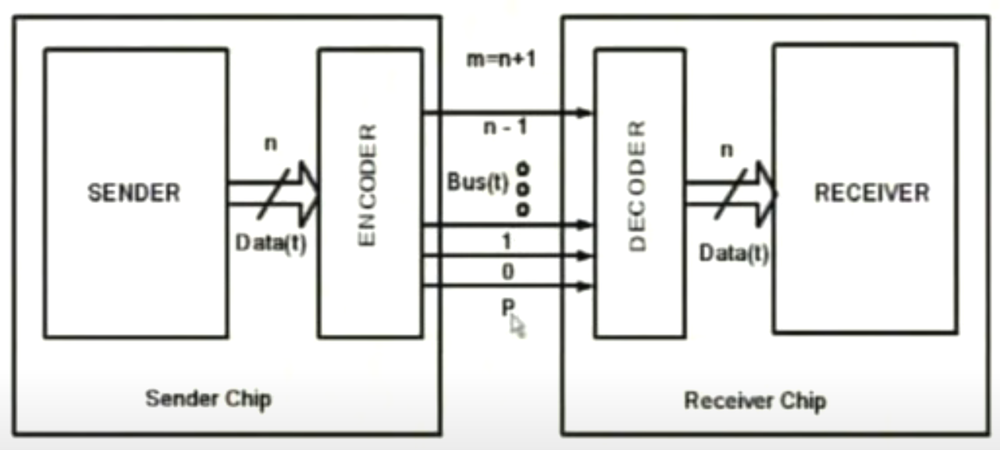
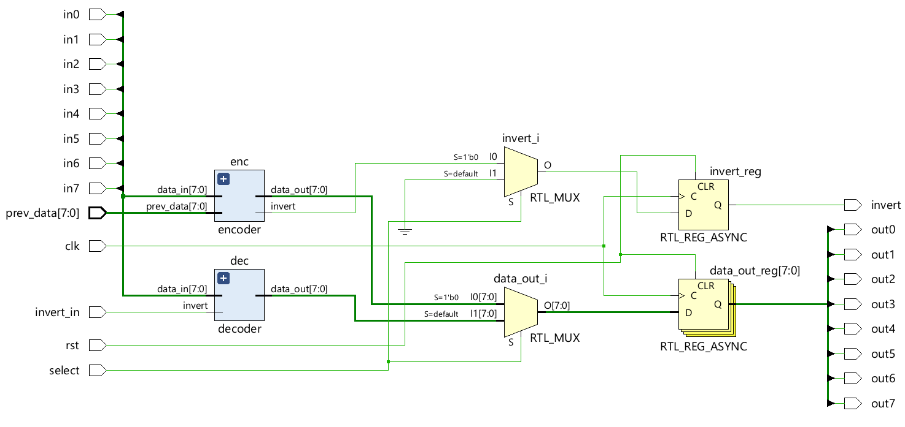
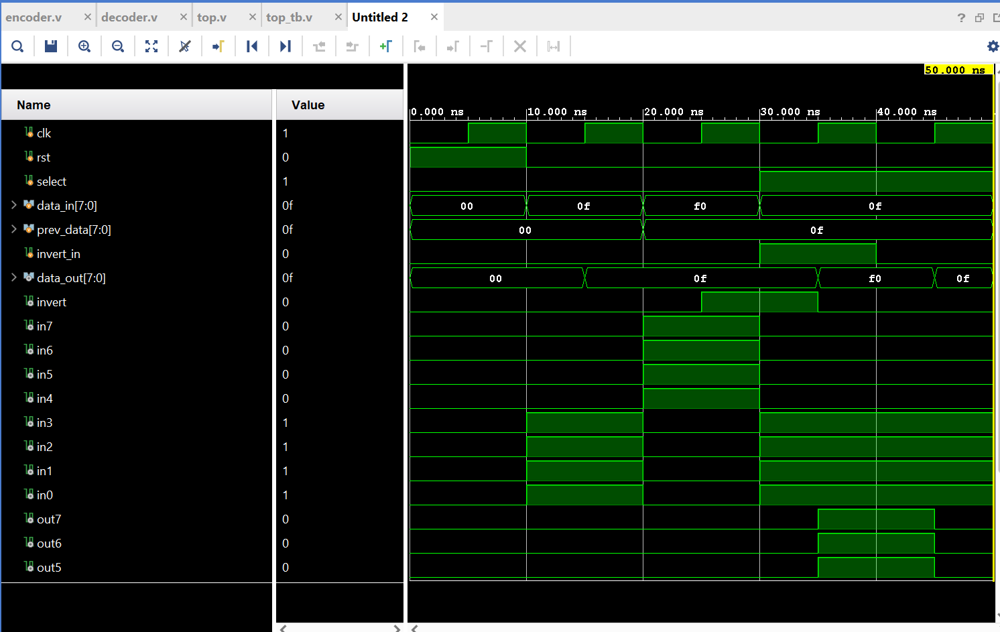
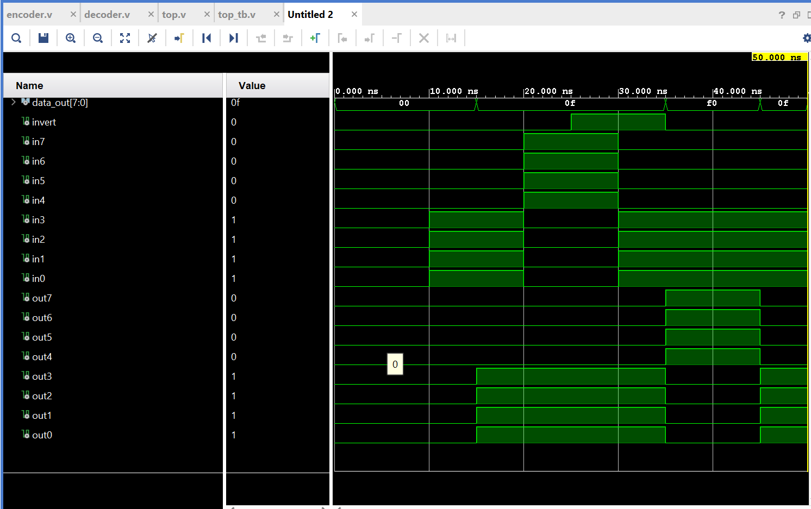

# Design-Implementation-of-Bus-Inversion-Coding-system-for-minimizing-switched-capacitance
## 📌 Theme
Minimizing switched capacitance during digital communication to reduce dynamic power consumption.

## 💡 Project Overview
This project focuses on the implementation of a Bus Inversion (BI) Coding System designed to reduce the number of bit transitions on a communication bus. By intelligently encoding data using the previous state, this technique minimizes switched capacitance, leading to reduced dynamic power consumption and electromagnetic interference (EMI) in both on-chip and off-chip communication.The system supports both encoding and decoding operations, controlled via a select line, and operates synchronously with a clock signal.

## 🎯 Objectives
1. Implement a bus encoding mechanism to reduce bit transitions.
2. Use a select line to switch between encoding and decoding modes.
3. Design a synchronous system with clock-driven input and output.
4. Provide a Verilog-based modular design suitable for FPGA/ASIC implementation.

## Block Diagram

## Verilog modules
| Sl No | Module Name | Description                                      |
|:-----:|:------------|:------------------------------------------------|
| 01    | top         | Main logic code                                  |
| 02    | encoder     | Performs encoding operation at sender            |
| 03    | decoder     | Performs decoding operation at receiver          |
| 04    | top_tb      | Consists of testbench for Vivado simulation      |

## Working Operation
| Sl No | Port Name | State | Operation                         |
|:------|:----------|:------|:---------------------------------|
| 01    | Sel       | HIGH  | Encoding Operation is performed |
| 02    | Sel       | LOW   | Decoding Operation is performed |

## I/O Interface Specifications
| Sl No | Pin No                            | Description             |
|:------|:----------------------------------|:---------------------  |
| 01    | 13                                | Select line             |
| 02    | 18                                | Clock input             |
| 03    | 19                                | Reset input             |
| 02    | [2, 3, 4, 6, 9, 10, 11, 12]       | Data input pins         |
| 03    | [37, 36, 35, 34, 32, 31, 28, 27]  | Data output pins        |

## RTL Schematic

## Simulation Results (Vivado)

